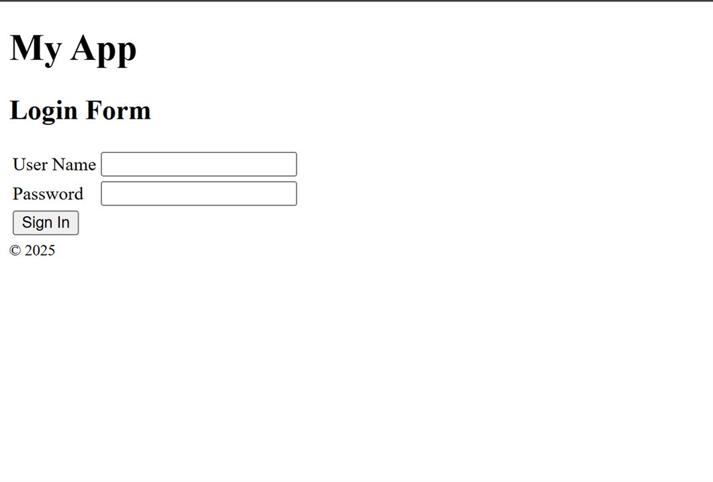
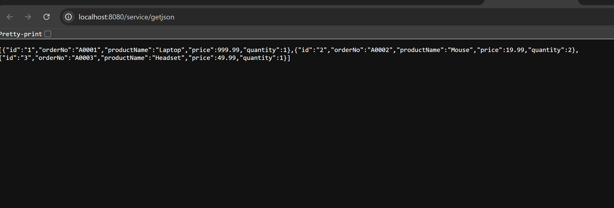
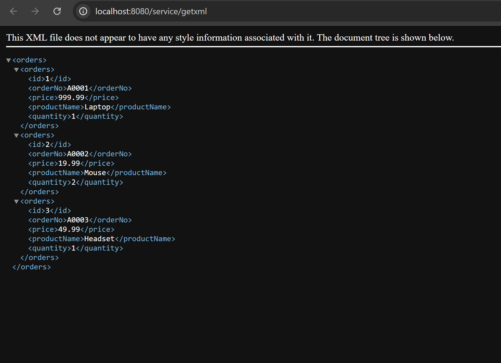
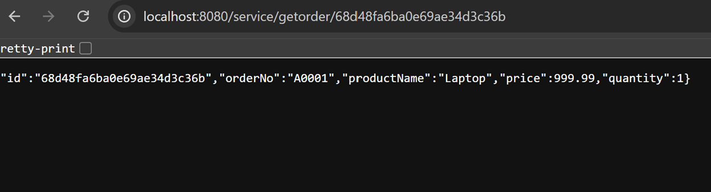
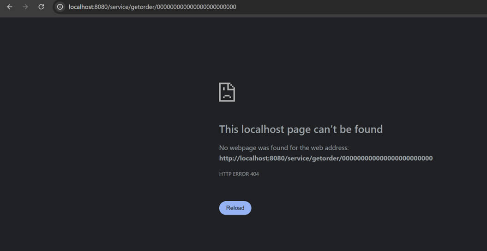

**Name:Devin Puckett**  
**Course:Cst-339**  
**Date:09/25/2025** 

**Professor:Bobby Estey**

---

## - Shows Login Page

This is my login page. The header shows My App and the section title says Login Form. I have two text boxes for User Name and Password and a Sign In button to submit the form. When I enter my credentials and click Sign In, the app checks the user and either takes me to the home page if the account is valid or shows an error on this screen if it is not. The simple layout is fine for the assignment, and the footer shows the year.
---

## -  Json Orders Page

This is my service returning all orders as JSON. I went to localhost:8080/service/get Json and it sent back a list with three records. The first is A0001 for a Laptop at 999.99 with quantity 1, the second is A0002 for a Mouse at 19.99 with quantity 2, and the third is A0003 for a Headset at 49.99 with quantity 1. Seeing the whole array confirms the endpoint is working and the app can serialize a collection to JSON. If I toggle pretty-print it will format the output, so it is easier to read.
---

## - XML Order Page

This shows my service returning to a full list of orders as XML. I went to localhost:8080/service/getxml, and the response contains three orders with fields id, orderNo, price, productName, and quantity. Order A0001 is a laptop for $ 999.99 with a quantity of 1. Order A0002 is a Mouse for $ 19.99 with a quantity of 2. Order A0003 is a Headset for $ 49.99 with a quantity of 1. The note at the top just means the browser is not using a stylesheet. This proves the endpoint can serialize a collection to XML and the field mapping is correct.
---

## - Json Through  ID 

This is my service returning a real order by id. I went to localhost:8080/service/getorder/68d48fa6ba0e69ae34d3c36b in the browser and it sent back a JSON record with id, orderNo A0001, productName Laptop, price 999.99, and quantity 1. This shows the endpoint is wired correctly and the app can read a single order from the database. If I check pretty-print it will format the JSON.end.
---

## - Wrong ID

This is me testing the getorder endpoint with a fake id full of zeros. The service responds with HTTP 404 Not Found and the page says this localhost page can’t be found. That means there is no order with that id and the endpoint is correctly returning a not found result. This confirms my error handling works and the service only returns data when I use a valid id.
---
## - Conclusion
In this assignment I built and tested a simple service layer and a basic login screen. The service returns a single order by id and a full list of orders in both JSON and XML. The screenshots show a real order coming back with id, order number, product name, price, and quantity. They also show the collection endpoints returning three sample orders. I verified error handling by calling getorder with a fake id and the service correctly returned 404 Not Found. That proves the routes, serialization, and status codes are wired the right way. I also have a clean login page that accepts a user name and password and hands control to the server for sign in. The main win is that the app can serve data in multiple formats and respond with the right HTTP result when data is missing. I kept the endpoints small, used clear field names, and confirmed the outputs directly in the browser. If I had more time, I would add input validation messages on the login page, pretty printing on the JSON view, and a small unit test to check that unknown ids always return 404. Overall, the core features work as designed and the service is ready to plug into a front end.
---
